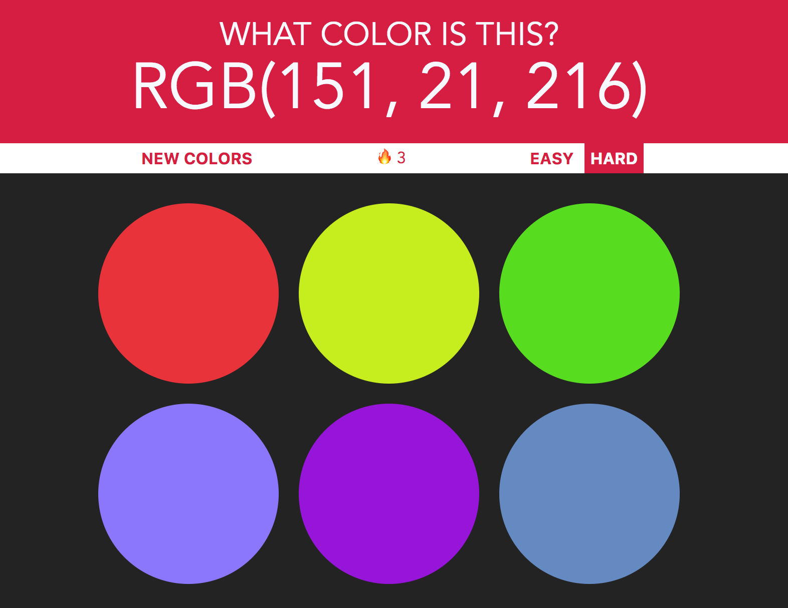

# What's This RGB?

[What's This RGB?](www.vutpham.com/color-game) is an interactive game to learn the RGB color model. It is written using pure vanilla JavaScript, HTML, and CSS.

What's This RGB? is designed to quickly teach the RGB color model by quickly generating new colors after every correct guess.



## Background

The RGB color model is an additive color model in which red, green and blue light are added together in various ways to reproduce a broad array of colors. The name of the model comes from the initials of the three additive primary colors, red, green and blue.

The syntax of RGB is as follows: `rgb(r, g, b)`, where the value of each color range between 0 and 255. **Black** is at `rbg(0, 0, 0)`, while **white** is at `rbg(255, 255,255)`. You can read more about the RBG color model [here](https://en.wikipedia.org/wiki/RGB_color_model).

## Features
- Modes (Easy / Hard)
- Randomized Colors
- Congratulatory Messages
- Correctness Streak

### Modes (Easy/Hard)

What's This RGB currently features an easy and a hard mode, where the only difference is the number of squares generated. Clicking on a mode button triggers an event listener to highlight the selected mode and render the appropriate number of squares. *Note:  Squares have been styled to appear circular.*

```javascript
function setModeButtons() {
  for (var i = 0; i < modeButtons.length; i++) {
    modeButtons[i].addEventListener("click", function () {
      // Remove 'selected' from buttons and adds 'selected' if clicked
      modeButtons[0].classList.remove("selected");
      modeButtons[1].classList.remove("selected");
      this.classList.add("selected");
      // Determines numSquares
      this.textContent === "Easy" ? numSquares = 3 : numSquares = 6;
      reset();
    });
  }
}
```

### Randomized Colors

The following code snippet handles the logic for generating the randomized RGB code:

```javascript
function randomColor() {
  //pick a R from 0-255
  let r = Math.floor(Math.random() * 256);
  //pick a G from 0-255
  let g = Math.floor(Math.random() * 256);
  //pick a B from 0-255
  let b = Math.floor(Math.random() * 256);

  return "rgb(" + r + ", " + g + ", " + b +")";
}
```

The generated RGB color is applied so each of the `numSquares` object.

### Congratulatory Message

A randomized congratulatory message is displayed on the reset button after every correct guess. A 'phrases' array was created and a phrase is selected by randomly selecting an index from the array. By using `phrases.length` to randomly select an index from the array, we can easily add more phrases to the list without having to rewrite our code in the future.

```javascript
function congrats() {
  let phrases;
  phrases = [
    "Nice!",
    "Wonderful!",
    "Great Job!",
    "Keep it up!",
    "Amazing!",
    "Awesome!",
    "You're good at this!"
  ];

  let random = Math.floor(Math.random() * phrases.length);
  return phrases[random];
}
```

### Correctness Streak 🔥

A streak is displayed in the messageDisplay query selector when there is a current streak. Streaks are achieved at 1 correct guess and are lost after an incorrect guess.

```javascript
if (streak) {
  messageDisplay.textContent = `🔥 ${streak}`;
} else {
  messageDisplay.textContent = "";
}
```

In order to not add to the streak counter by continuously clicking on the correct colors after a correct guess, the `addStreak()` function tests to see if "Correct!" is currently rendered on the messageDisplay block.  The code snippet can be seen below:  

```javascript
var streak = 0;

function addStreak(){
  if (messageDisplay.textContent !== "Correct!") {
    streak += 1;
  }
}

function resetStreak(){
  streak = 0;
}
```

## Future Improvements
- [x] Automatically reset game after 2s after the user makes a correct guess
- [x] Allow users to keep track of the number of correct guesses

- [ ] Improve the difficulty of game modes with better-generated decimal codes values
    - Easy Mode:  Decimal code values are all at least 100 away from the actual color
    - Hard Mode:  Decimal code values are within 50 away from the actual color
